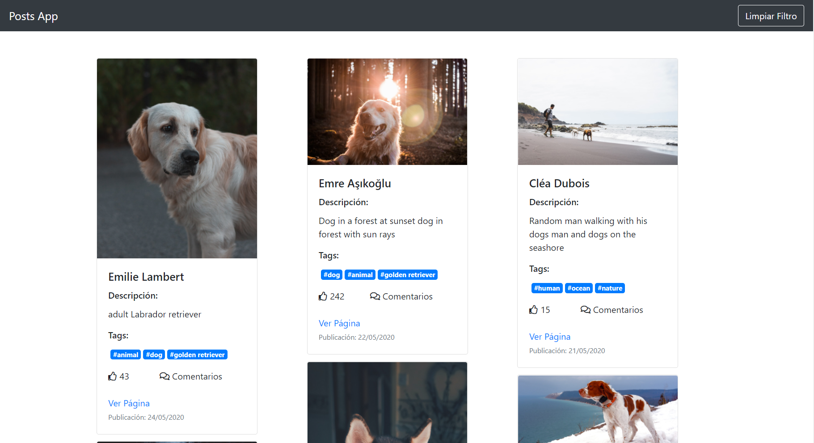
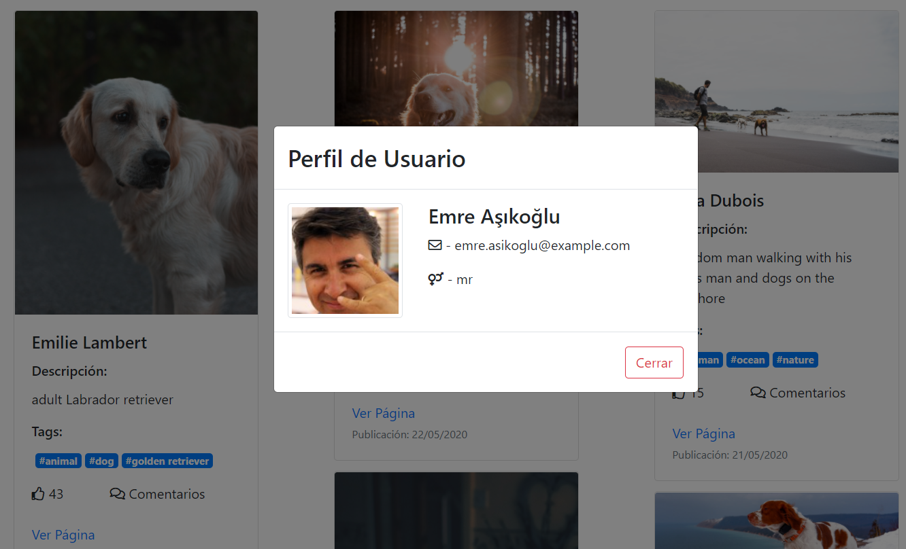
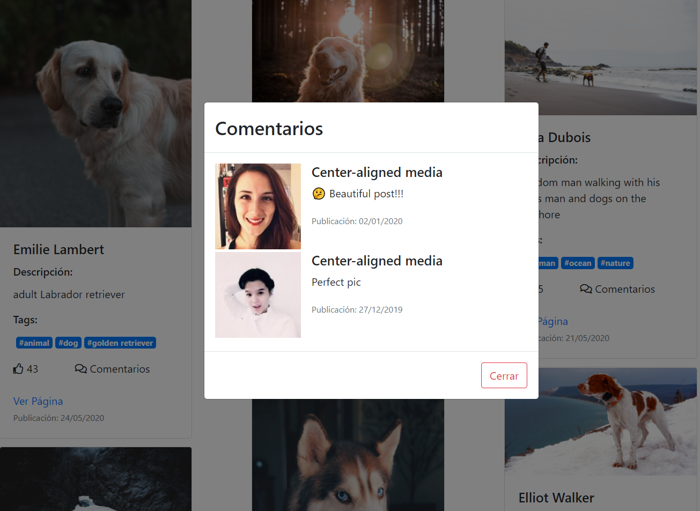
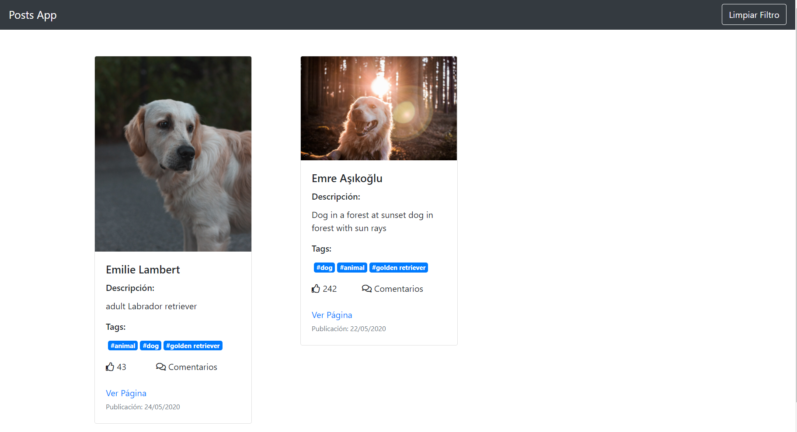

# PostsApp

Este es un proyecto hecho con Angular en su versión 10.1.1, consta de aplicación para ver posts de mascotas de diferentes personas en el mundo.

### Links de Aplicación

```
https://gvillegasc.github.io/Posts-App/
```

## Pre-requisitos📋

Para probar este proyecto se necesita las siguientes herramientas de software.

### Node.JS

Para descargar e instalar NodeJS, ir al siguiente link:

```
    https://nodejs.org/es/download/
```

### TypeScript

Para instalar angular ejecutar el siguiente comando en la terminal del equipo:

```
     npm install -g typescript
```

### Angular CLI

Para instalar angular ejecutar el siguiente comando en la terminal del equipo:

```
    npm install -g @angular/cli
```

## Instalación del Proyecto 🔧

Clonar el siguiente repositorio: (https://github.com/gvillegasc/Posts-App)

Acceder a la carpeta del proyecto clonado, y ejecutar el comando `npm install` para decargar los paquete de Node.JS.

Una vez instalado los paquetes de NodeJS, ejecutar el comando `ng serve -o` para probar el proyecto.

## Despliegue

Ejecutar `npm run build` o `ng build` para generar el proyecto en modo producción.

## Herramientas Usadas

### - NodeJS

### - Typescript

### - Angular

### - Bootstrap

### - Fontawesome

## Demostración del Proyecto

Imagenes de la aplicación.

Link de demostración.
(https://gvillegasc.github.io/Posts-App/)





